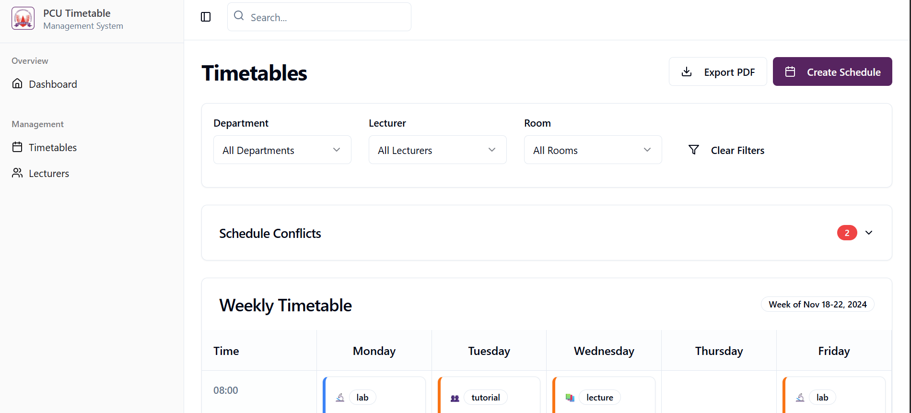

# 🗓️ PCU Timetable Scheduler

A modern web-based timetable scheduling platform for **Precious Cornerstone University (PCU)**. This system allows departments to create, manage, detect conflicts, and export class schedules efficiently.

---

## ✨ Features

- 🔍 **Dynamic Schedule Viewer**
  - Weekly grid layout by department, lecturer, or room
  - Hover actions for edit, move, duplicate, and delete

- ⚙️ **Schedule Management**
  - Create new schedules with start time, duration, lecturer, and room
  - Auto-fill course details and room capacity
  - Reusable dropdowns and modals

- 🚨 **Conflict Detection & Resolution**
  - Detects time and room overlaps
  - Inline conflict resolution with ability to delete, move, or annotate conflicts

- 📤 **PDF Export**
  - Branded export with university logo and headers
  - Auto-splits long timetables into multiple pages
  - High-resolution output using `html2canvas` and `jsPDF`

- 📚 **Filtering**
  - Filter timetable by Department, Lecturer, or Room
  - Smart layout adjustments per selection

---

## 🏗️ Tech Stack

- **Frontend**: React + TypeScript
- **UI Library**: ShadCN (Tailwind-based)
- **State Management**: React Hooks
- **Backend**: [Supabase](https://supabase.com/)
- **PDF Export**: `html2canvas` + `jsPDF`

---
